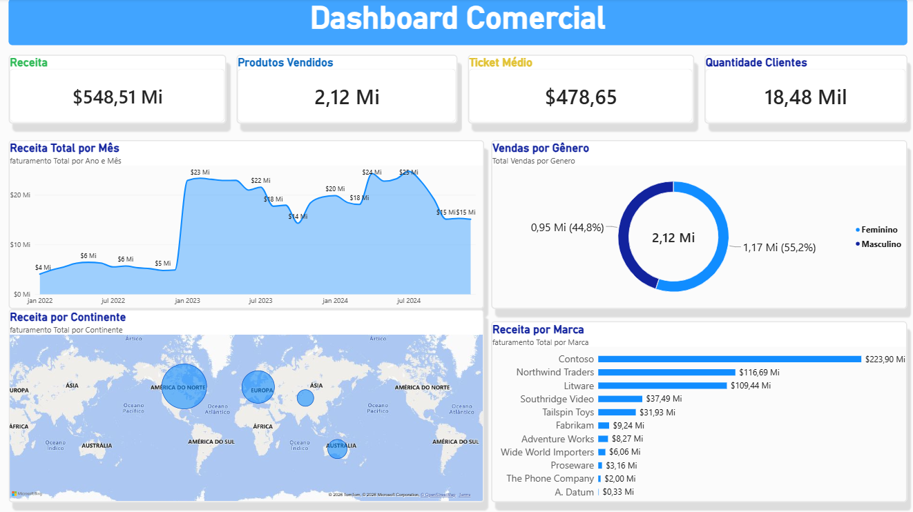

# 📊 Análise de Vendas — Power BI

Projeto de análise de dados desenvolvido em Power BI com o objetivo de analisar o desempenho comercial da empresa, identificando padrões de receita, evolução ao longo do tempo, principais regiões, marcas e características dos clientes.

## 🎯 Objetivo do projeto

Analisar os dados de vendas para identificar padrões de desempenho, principais fontes de receita e oportunidades de negócio, transformando os dados em informações que possam apoiar a tomada de decisões.

## 🛠️ Ferramentas utilizadas

- **Excel** — fonte dos dados
- **Power Query** — tratamento e transformação dos dados
- **Power BI** — modelagem e criação do dashboard
- **DAX** — criação de medidas e métricas

## 🔄 Tratamento e preparação dos dados

Antes da construção do dashboard, os dados foram tratados e preparados no Power Query.

As principais etapas realizadas foram:

- Importação de tabelas provenientes do Excel;
- Transformação e padronização dos dados;
- Junção de diferentes tabelas;
- Criação de novas colunas;
- Exclusão de colunas desnecessárias;
- Organização e preparação da base para análise no Power BI.

## 📌 Principais indicadores

| Indicador | Resultado |
|---|---:|
| Receita Total | R$ 548,51 Mi |
| Produtos Vendidos | 2,12 Mi |
| Ticket Médio | R$ 478,65 |
| Quantidade de Clientes | 18,48 mil |

## 🔎 Principais insights

- **Pico de receita:** Julho de 2024 apresentou a maior receita do período, com aproximadamente **R$ 24,28 milhões**.

- **Destaque regional:** A **América do Norte** apresentou a maior receita, alcançando aproximadamente **R$ 321,89 milhões**.

- **Marca líder:** A **Contoso** apresentou a maior receita entre as marcas analisadas, com aproximadamente **R$ 223,90 milhões**.

- **Concentração de receita:** As três principais marcas — **Contoso, Northwind Traders e Litware** — representam aproximadamente **82% da receita total**, indicando uma forte concentração do faturamento.

- **Liderança consistente:** A **América do Norte** e a **Contoso** aparecem entre as líderes de receita em aproximadamente **99,9% dos períodos analisados**, indicando um padrão recorrente de desempenho.

- **Perfil de vendas:** O público **feminino representa 55,2% das vendas**, enquanto o público masculino representa 44,8%.

## 💡 Recomendações de negócio

Com base nos resultados encontrados, algumas ações podem ser consideradas:

- Investigar os fatores que contribuem para o forte desempenho da **América do Norte**;
- Avaliar a dependência da receita em relação às principais marcas e buscar oportunidades de diversificação;
- Investigar os fatores associados ao pico de receita observado em **julho de 2024**;
- Analisar o desempenho da **Contoso** para identificar quais produtos e regiões mais contribuem para sua receita;
- Avaliar oportunidades de crescimento em regiões e marcas com menor participação no faturamento.

## 📊 Dashboard

